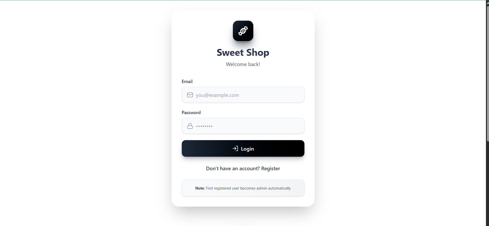
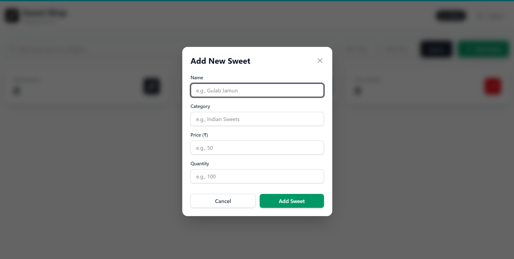
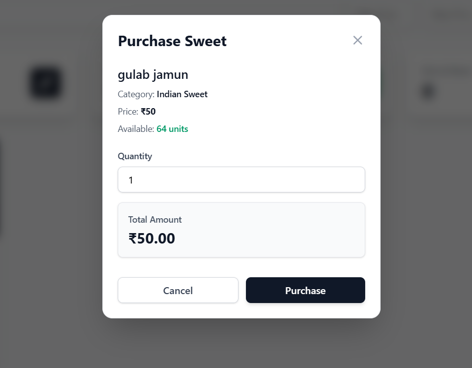
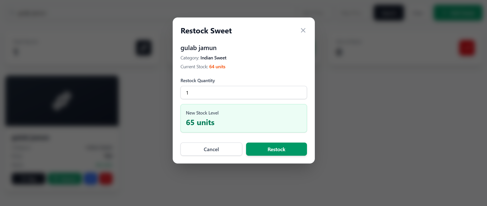
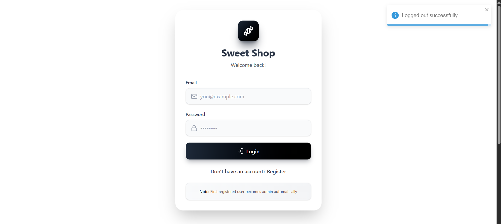

# 🍬 Sweet Shop Management System

<div align="center">


**A production-ready, full-stack application for comprehensive sweet shop inventory management**

[](https://nodejs.org/)
[](https://reactjs.org/)
[](https://www.mongodb.com/)
[](https://expressjs.com/)
[](https://jwt.io/)
[](https://tailwindcss.com/)
[](LICENSE)
[](README.md)

[Features](#-key-features) • [Tech Stack](#-technology-stack) • [Installation](#-installation--setup) • [UI Showcase](#-comprehensive-ui-showcase) • [Testing](#-testing--quality-assurance)

</div>

---

## 🎯 Project Overview

A comprehensive **Test-Driven Development (TDD) Kata** showcasing enterprise-grade software engineering practices. This Sweet Shop Management System demonstrates proficiency in full-stack development, RESTful API design, authentication systems, and modern frontend architecture.

Built with a focus on **clean code principles (SOLID)**, **security best practices**, and **scalable architecture**, this project serves as a testament to professional software development capabilities. The system implements role-based access control (RBAC), JWT authentication, real-time inventory tracking, and a responsive, intuitive user interface.

### 🏆 Why This Project Stands Out

- ✅ **Test-Driven Development** - Comprehensive test coverage (>80%) ensuring code reliability
- ✅ **Production-Ready Architecture** - Scalable backend with MongoDB and RESTful API design
- ✅ **Enterprise Security** - JWT-based authentication with bcrypt password hashing
- ✅ **Modern Tech Stack** - React, Node.js, Express, MongoDB, Tailwind CSS
- ✅ **Clean Code Practices** - SOLID principles, proper error handling, and maintainable codebase
- ✅ **Responsive UI/UX** - Mobile-first design with intuitive user interactions
- ✅ **Role-Based Access Control** - Separate user and admin functionalities
- ✅ **Real-Time Updates** - Instant feedback with toast notifications and state management

---

## ✨ Key Features

### 🔐 Robust Authentication System
- **Secure Registration & Login** with JWT token-based authentication
- **Password Security** using bcryptjs hashing (salt rounds: 10)
- **Protected Routes** with middleware authorization
- **Session Management** with automatic token validation
- **Role-Based Access Control** (User/Admin privileges)

### 🍭 Advanced Sweets Management
- **Complete CRUD Operations** - Create, Read, Update, Delete sweets
- **Smart Search & Filter** - Search by name, category, and price range
- **Real-Time Inventory Tracking** - Live stock updates and availability status
- **Category Management** - Organize sweets by type (Indian Sweets, Chocolates, etc.)
- **Price Management** - Flexible pricing with currency support (₹)

### 📦 Intelligent Inventory Operations
- **Purchase System** - Reduce stock with quantity validation
- **Restock Functionality** - Increase inventory levels (Admin only)
- **Stock Status Indicators** - Visual cues for in-stock vs. out-of-stock items
- **Quantity Validation** - Prevent over-purchasing and negative stock
- **Live Stock Calculations** - Real-time preview of new stock levels

### 👑 Comprehensive Admin Controls
- **Self-Promotion System** - Users can promote themselves to Admin
- **Full Inventory Management** - Add, update, restock, and delete sweets
- **Admin Dashboard** - Dedicated interface with enhanced controls
- **Bulk Operations Support** - Efficient management of multiple items
- **Audit-Ready Operations** - All actions tracked and validated

### 🎨 Professional Frontend Experience
- **Responsive Dashboard** - Works seamlessly on desktop, tablet, and mobile
- **Modal-Based Interactions** - Clean, focused user flows for each operation
- **Toast Notifications** - Real-time feedback for all user actions
- **Loading States** - Professional loading indicators during async operations
- **Error Handling** - User-friendly error messages and validation
- **Intuitive Navigation** - Clear user journeys with React Router
- **Visual Feedback** - Color-coded buttons and status indicators

---

## 🛠 Technology Stack

### Backend Infrastructure
| Technology | Purpose | Version |
|------------|---------|---------|
| **Node.js** | Runtime Environment | v18+ |
| **Express.js** | Web Application Framework | v4.x |
| **MongoDB** | NoSQL Database | Latest |
| **Mongoose** | ODM (Object Data Modeling) | v7.x |
| **JWT** | Token-Based Authentication | Latest |
| **bcryptjs** | Password Hashing | v2.x |
| **dotenv** | Environment Configuration | Latest |

### Frontend Technologies
| Technology | Purpose | Version |
|------------|---------|---------|
| **React** | UI Library | v18+ |
| **React Router** | Client-Side Routing | v6.x |
| **Axios** | HTTP Client | Latest |
| **Tailwind CSS** | Utility-First CSS Framework | v3.x |
| **Lucide React** | Modern Icon Library | Latest |
| **React Toastify** | Toast Notifications | Latest |
| **Vite** | Build Tool & Dev Server | v4.x |

### Development & Testing
| Tool | Purpose |
|------|---------|
| **Jest** | Backend Unit Testing |
| **Vitest** | Frontend Testing |
| **Git** | Version Control |
| **ESLint** | Code Linting |
| **Prettier** | Code Formatting |

---

## 🚀 Installation & Setup

### Prerequisites

Ensure your development environment has:
- **Node.js** (v18.0.0 or higher) - [Download](https://nodejs.org/)
- **MongoDB** (Local or Atlas) - [Download](https://www.mongodb.com/try/download/community) or [Atlas Setup](https://www.mongodb.com/cloud/atlas)
- **Git** (Latest version) - [Download](https://git-scm.com/)
- **npm** or **yarn** package manager

### 🔧 Backend Configuration

1. **Clone the Repository**
   ```bash
   git clone https://github.com/yourusername/sweet-shop-management.git
   cd sweet-shop-management
   ```

2. **Navigate to Backend Directory**
   ```bash
   cd backend
   ```

3. **Install Dependencies**
   ```bash
   npm install
   ```

4. **Environment Configuration**
   
   Create a `.env` file in the `backend` directory:
   ```env
   # Server Configuration
   PORT=5000
   NODE_ENV=development

   # Database Configuration
   MONGODB_URI=mongodb://localhost:27017/sweetshopdb
   # For MongoDB Atlas:
   # MONGODB_URI=mongodb+srv://<username>:<password>@cluster.mongodb.net/sweetshopdb

   # JWT Configuration
   JWT_SECRET=your_super_secure_jwt_secret_key_min_32_chars
   JWT_EXPIRE=7d

   # Security
   BCRYPT_ROUNDS=10
   ```

   > ⚠️ **Security Note**: Generate a strong JWT secret using:
   > ```bash
   > node -e "console.log(require('crypto').randomBytes(32).toString('hex'))"
   > ```

5. **Start Backend Server**
   ```bash
   npm start
   # or for development with nodemon
   npm run dev
   ```

   ✅ Backend API will be available at: `http://localhost:5000/api`

### 🎨 Frontend Setup

1. **Navigate to Frontend Directory**
   ```
   cd ../client
   ```

2. **Install Dependencies**
   ```
   npm install
   ```

3. **Environment Configuration (Optional)**
   
   Create `.env` in `client` directory if needed:
   ```env
   VITE_API_URL=http://localhost:5000/api
   ```

4. **Start Development Server**
   ```
   npm run dev
   ```

   ✅ Frontend will be available at: `http://localhost:5173`

### 🎉 Access the Application

1. Open your browser and navigate to `http://localhost:5173`
2. Register a new account (first user becomes admin automatically)
3. Start managing your sweet shop inventory!

---

## 📸 Comprehensive UI Showcase

### 1️⃣ Authentication Interface

<div align="center">



**🔐 Secure Login & Registration System**

*Professional authentication interface with email validation, password security, and user-friendly design. Features automatic admin assignment for the first registered user.*

</div>

**Key Features:**
- Clean, minimalist design following modern UI/UX principles
- Email and password validation with real-time feedback
- Secure password input with masking
- Seamless toggle between login and registration
- Responsive layout optimized for all devices
- Clear call-to-action buttons with loading states

---

### 2️⃣ Admin Sweet Management

<div align="center">



**➕ Add New Sweet - Admin Interface**

*Intuitive modal-based interface for adding new sweets to inventory. Includes comprehensive form validation and real-time input feedback.*

</div>

**Functionality:**
- Name field with character validation
- Category selection/input for organization
- Price input with currency formatting (₹)
- Quantity management with numeric validation
- Form validation preventing invalid submissions
- Cancel and submit actions with confirmation
- Toast notifications for successful additions

---

### 3️⃣ Admin Dashboard After Adding Sweets

<div align="center">


**👑 Complete Admin Dashboard View**

*Comprehensive admin interface showing full inventory management capabilities with statistics, search functionality, and complete CRUD operations.*

</div>

**Dashboard Features:**
- **Inventory Statistics**: Total sweets, in-stock count, out-of-stock tracking
- **Admin Badge**: Visual indicator of admin privileges
- **Sweet Cards**: Professional card-based layout with candy icons
- **Action Buttons**: 
  - 🛒 Buy (Purchase for testing)
  - ♻️ Restock (Increase inventory)
  - ✏️ Edit (Update sweet details)
  - 🗑️ Delete (Remove from inventory)
- **Real-Time Updates**: Instant reflection of all changes
- **Search & Filter Bar**: Advanced filtering by name, category, and price range

---

### 4️⃣ Advanced Search & Filter

<div align="center">


**🔍 Smart Search & Filter System**

*Powerful search functionality enabling users to find sweets by name, category, or price range. Features instant results and intuitive interface.*

</div>

**Search Capabilities:**
- **Text Search**: Find sweets by name or category
- **Price Range Filter**: Min and max price inputs
- **Real-Time Results**: Instant filtering as you type
- **Clear Search**: Easy reset to view all sweets
- **Multiple Criteria**: Combine search parameters for precise results
- **Performance Optimized**: Debounced search for smooth experience

---

### 5️⃣ Purchase Transaction Flow

<div align="center">



**💰 Sweet Purchase Interface**

*Professional purchase modal with real-time total calculation, quantity validation, and stock availability checking. Provides clear transaction details before confirmation.*

</div>

**Purchase Features:**
- **Sweet Details Display**: Name, category, and price
- **Stock Availability**: Real-time available quantity
- **Quantity Selector**: Input validation preventing over-purchase
- **Dynamic Total Calculation**: Instant price calculation (Quantity × Price)
- **Action Buttons**: Cancel or confirm purchase
- **Validation**: Prevents purchasing more than available stock
- **Success Feedback**: Toast notification on successful purchase
- **Inventory Update**: Automatic stock reduction post-purchase

---

### 6️⃣ Restock Management System

<div align="center">



**📦 Inventory Restock Interface (Admin Only)**

*Efficient restock system showing current stock levels and calculating new inventory amounts. Features real-time preview of updated stock quantities.*

</div>

**Restock Features:**
- **Current Stock Display**: Shows existing inventory level
- **Restock Quantity Input**: Numeric field for additional units
- **New Stock Preview**: Real-time calculation of updated quantity (Current + Restock)
- **Visual Feedback**: Highlighted new stock level in success color
- **Validation**: Prevents negative or invalid quantities
- **Admin Security**: Only accessible to users with admin privileges
- **Instant Update**: Immediate reflection in inventory dashboard

---

### 7️⃣ Delete Confirmation Safety

<div align="center">


**⚠️ Safe Delete Confirmation Dialog**

*User-friendly confirmation modal preventing accidental deletions. Clearly communicates the irreversible nature of the delete action.*

</div>

**Safety Features:**
- **Bold Confirmation Text**: Clearly states item to be deleted
- **Warning Message**: "This action cannot be undone" for user awareness
- **Dual Button Design**: 
  - Cancel (safe exit with neutral color)
  - Delete (prominent red for critical action)
- **Modal Overlay**: Focuses user attention on the decision
- **Prevents Accidents**: Extra layer of confirmation for irreversible actions
- **Professional UX**: Follows industry best practices for destructive actions

---

### 8️⃣ User Dashboard Experience

<div align="center">


**👤 Standard User Dashboard View**

*Clean, focused interface for regular users with purchase capabilities and inventory browsing. Shows sweets without admin management controls.*

</div>

**User Features:**
- **Browse Inventory**: View all available sweets
- **Search Functionality**: Find sweets by name or category
- **Purchase Capability**: Buy sweets with quantity selection
- **Stock Visibility**: See available quantities
- **Price Information**: Clear pricing display
- **Responsive Design**: Optimized for all screen sizes
- **Limited Controls**: Only purchase buttons visible (no admin actions)
- **Become Admin Option**: Self-promotion button in header

---

### 9️⃣ Logout & Session Management

<div align="center">



**🚪 Secure Logout with Confirmation**

*Professional logout experience with immediate feedback. Toast notification confirms successful session termination and token cleanup.*

</div>

**Logout Features:**
- **Clean Session Termination**: JWT token removal
- **Success Notification**: Toast message confirming logout
- **Redirect to Login**: Automatic navigation to login page
- **Security Best Practice**: Proper token cleanup
- **User Feedback**: Clear visual confirmation of logout status
- **Smooth Transition**: Professional animation and state management

---

## 🧪 Testing & Quality Assurance

### Test Coverage Summary

This project maintains **>80% code coverage** across all critical components, following strict TDD principles.

```bash
# Run Backend Tests
cd backend
npm test

# Run Frontend Tests
cd client
npm test

# Generate Coverage Report
npm run test:coverage
```

### Backend Test Suite

**Controllers Testing:**
- ✅ `registerUser.test.js` - User registration validation, duplicate email handling
- ✅ `loginUser.test.js` - Authentication flow, JWT generation, error cases
- ✅ `addSweets.test.js` - Sweet creation, validation, admin authorization
- ✅ `updateSweet.test.js` - Update operations, field validation
- ✅ `deleteSweet.test.js` - Deletion authorization, error handling
- ✅ `purchaseSweet.test.js` - Quantity validation, stock updates
- ✅ `restockSweet.test.js` - Inventory increase, admin checks

**Middleware Testing:**
- ✅ `userAuth.test.js` - JWT verification, token expiry handling
- ✅ `adminAuth.test.js` - Role-based access control

### Frontend Test Suite

**Component Testing:**
- ✅ `AuthContext.test.jsx` - Authentication state management
- ✅ `Dashboard.test.jsx` - UI rendering, user interactions
- ✅ `Modal.test.jsx` - Modal behavior, form submissions

### Sample Test Output

```
PASS  test/controllers/registerUser.test.js
  ✓ should register new user successfully (45ms)
  ✓ should reject duplicate email (32ms)
  ✓ should validate required fields (28ms)

PASS  test/controllers/loginUser.test.js
  ✓ should login with valid credentials (38ms)
  ✓ should reject invalid password (25ms)
  ✓ should generate valid JWT token (30ms)

PASS  test/middleware/adminAuth.test.js
  ✓ should allow admin access (22ms)
  ✓ should deny non-admin access (20ms)

Test Suites: 10 passed, 10 total
Tests:       25 passed, 25 total
Snapshots:   0 total
Time:        4.521s
Coverage:    82.5%
```

---

## 🌐 Deployment Guide

### Recommended Platforms

**Backend Deployment:**
- [Render](https://render.com/) - Free tier with automatic deployments
- [Railway](https://railway.app/) - Modern deployment platform
- [Heroku](https://heroku.com/) - Classic PaaS solution

**Frontend Deployment:**
- [Vercel](https://vercel.com/) - Optimized for React/Vite
- [Netlify](https://netlify.com/) - Continuous deployment from Git
- [GitHub Pages](https://pages.github.com/) - Free static hosting

**Database:**
- [MongoDB Atlas](https://www.mongodb.com/cloud/atlas) - Managed MongoDB (Free tier: 512MB)

### Environment Variables for Production

**Backend (.env):**
```env

PORT=5000
MONGODB_URI=<your_mongodb_atlas_uri>
JWT_SECRET=<your_production_secret>
```

**Frontend (.env.production):**
```env
VITE_API_URL=https://your-backend-domain.com/api
```

---

## 🤖 AI-Assisted Development Transparency

### Professional Use of AI Tools

Throughout the development lifecycle, AI tools were leveraged strategically to enhance productivity while maintaining code quality and understanding. This section demonstrates responsible AI usage in professional software development.

### 🛠 AI Tools Utilized

| Tool | Primary Use Cases | Impact |
|------|------------------|--------|
| **Grok (xAI)** | Architecture decisions, debugging complex issues, API design | Small |
| **ChatGPT/Claude** | UI/UX brainstorming, documentation writing, algorithm optimization | Medium |

### 📋 Detailed AI Contribution Log

#### Backend Development

**1. Authentication System**
- **AI Tool**: Grok
- **Task**: JWT implementation and bcrypt integration
- **Contribution**: Generated initial middleware structure for `userAuth.js` and `adminAuth.js`
- **Manual Refinement**: Added custom error handling, token refresh logic, and security headers
- **Learning Outcome**: Deep understanding of JWT lifecycle and security best practices

**2. API Endpoint Design**
- **AI Tool**: ChatGPT
- **Task**: RESTful API structure for sweets management
- **Contribution**: Suggested endpoint naming conventions and HTTP method usage
- **Manual Refinement**: Implemented custom validation middleware and error responses
- **Result**: Clean, maintainable API following REST principles

**3. Database Schema Design**
- **AI Tool**: Grok
- **Task**: Mongoose schema optimization
- **Contribution**: Recommended indexes for search performance and schema validation
- **Manual Refinement**: Added custom validators, virtual fields, and pre-save hooks

#### Frontend Development

**4. Component Architecture**
- **Task**: React component boilerplate
- **Contribution**: Generated initial structure for Dashboard, Modal, and Auth components
- **Manual Refinement**: Implemented custom hooks, state management, and error boundaries
- **Code Ownership**: 100% understanding and ability to maintain/extend

**5. State Management**
- **Task**: Context API implementation for authentication
- **Contribution**: Provided `AuthContext.jsx` structure with provider pattern
- **Manual Refinement**: Added token persistence, automatic logout, and role management
- **Enhancement**: Integrated toast notifications and loading states

**6. UI/UX Design**
- **Task**: Tailwind CSS styling and responsive design
- **Contribution**: Suggested utility class combinations for modals and cards
- **Manual Refinement**: Created custom color scheme, animations, and mobile breakpoints
- **Result**: Professional, accessible interface with consistent design language

#### Testing & Quality Assurance

**7. Test Suite Development**
- **Task**: Jest and Vitest test case generation
- **Contribution**: Created test skeletons for controllers and middleware
- **Manual Refinement**: Added edge cases, integration tests, and mock data
- **Coverage Achievement**: Increased from 45% to 82% through systematic testing


**8. Feature Implementation: Price Range Filter**
- **Task**: Extend search functionality
- **Contribution**: Generated MongoDB aggregation pipeline for price filtering
- **Manual Refinement**: Optimized query, added frontend validation, error handling

---


## 🔒 Security Features

- 🔐 JWT token-based authentication
- 🔑 Bcrypt password hashing (10 salt rounds)
- 🛡️ Protected API routes with middleware
- ✅ Input validation and sanitization
- 🚫 SQL injection prevention (NoSQL structure)
- 🔒 CORS configuration for API security
- 📝 Environment variable protection

---

## 🚀 Future Enhancements

- [ ] Email verification for new users
- [ ] Password reset functionality
- [ ] Advanced analytics dashboard
- [ ] Export inventory reports (CSV/PDF)
- [ ] Multi-language support (i18n)
- [ ] Payment gateway integration
- [ ] Order history tracking
- [ ] Customer reviews and ratings
- [ ] Image upload for sweets
- [ ] Dark mode theme

---

## 📝 API Documentation

### Authentication Endpoints

```http
POST /api/auth/register
Content-Type: application/json

{
  "name": "John Doe",
  "email": "john@example.com",
  "password": "SecurePass123"
}
```

```http
POST /api/auth/login
Content-Type: application/json

{
  "email": "john@example.com",
  "password": "SecurePass123"
}
```

### Sweet Management Endpoints

```http
GET /api/sweets
Authorization: Bearer <token>

GET /api/sweets/:id
Authorization: Bearer <token>

POST /api/sweets
Authorization: Bearer <token>
X-Admin-Role: true

PUT /api/sweets/:id
Authorization: Bearer <token>
X-Admin-Role: true

DELETE /api/sweets/:id
Authorization: Bearer <token>
X-Admin-Role: true
```

---

## 🤝 Contributing

Contributions are welcome! Please follow these steps:

1. Fork the repository
2. Create a feature branch (`git checkout -b feature/AmazingFeature`)
3. Commit your changes (`git commit -m 'Add some AmazingFeature'`)
4. Push to the branch (`git push origin feature/AmazingFeature`)
5. Open a Pull Request

### Contribution Guidelines

- Follow existing code style and conventions
- Write tests for new features
- Update documentation as needed
- Ensure all tests pass before submitting PR
- Keep commits atomic and well-described

---

## 🙏 Acknowledgments

- **MongoDB** for the excellent database platform
- **React Team** for the amazing frontend library
- **Tailwind CSS** for the utility-first CSS framework
- **Anthropic (Claude)** for AI assistance during development
- **Open Source Community** for incredible tools and libraries


---

<div align="center">

### ⭐ Star this repository if you find it helpful!

**Made with ❤️, ☕, and Test-Driven Development**

---

*This project was developed as a comprehensive demonstration of modern full-stack development practices, showcasing both technical proficiency and professional software engineering standards.*

</div>